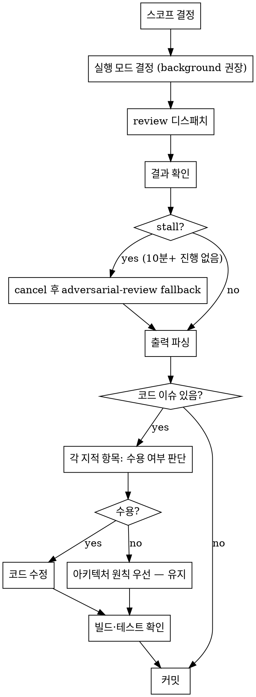

# Codex Code Review

## Overview

Codex `review` 서브커맨드를 사용해 구현 코드를 리뷰한다.
`codex-spec-review`와 달리 ISSUES 형식 강제·ACCEPT/REBUT 루프 없음 — built-in reviewer가 자유 형식으로 피드백을 제공하고, Claude가 판단 후 코드를 직접 수정한다.

**언제 사용:** WU 구현 완료 후, PR 생성 전에 실행.

---

## 플러그인 경로 해석 (버전 agnostic)

`codex-companion.mjs` 경로를 하드코딩하지 않고 설치된 최신 버전을 런타임에 resolve한다. bash command는 반드시 `node`로 시작해야 permission rule `Bash(node:*)`에 매칭된다.

```bash
node "$(ls -d /home/yeop/.claude-work/plugins/cache/openai-codex/codex/*/ | sort -V | tail -1)scripts/codex-companion.mjs" <subcommand> [args...]
```

---

## 프로세스



---

## Step 1 — 스코프 결정

| 상황 | `--scope` | `--base` |
|------|-----------|---------|
| 미커밋 변경만 검토 | `working-tree` | 불필요 |
| 현재 브랜치 전체 diff | `branch` | `--base dev` |
| Codex가 자동 판단 | 생략 (auto) | 필요 시 `--base <ref>` |

---

## Step 2 — 실행 모드 결정

**기본값: `--background`** — feature-workflow의 코드 리뷰는 브랜치 전체 diff를 대상으로 하여 파일이 많으므로 background + polling이 안전하다.

| 조건 | 권장 |
|------|------|
| 변경 파일 1~2개, 명백히 작음 | `--wait` 사용 가능 |
| 변경 파일 3개 이상 또는 size 불확실 | `--background` 권장 |
| 대규모 브랜치 diff | `--background` 필수 |

> **Issue 노트 (1.0.3 기준):** `review` foreground(`--wait`) 경로는 내부 `captureTurn`에 heartbeat/timeout이 없어 Codex API가 stall하면 **무한 대기** 가능. Background + polling이 현실적 우회책.

---

## Step 3 — 리뷰 디스패치

### Background (권장)

Bash tool에서 `run_in_background: true`로 실행:

```bash
node "$(ls -d /home/yeop/.claude-work/plugins/cache/openai-codex/codex/*/ | sort -V | tail -1)scripts/codex-companion.mjs" review --background --scope branch --base dev
```

출력에서 job-id(`review-xxxx`)를 추출해 기록한다.

### Foreground (작은 diff만)

```bash
node "$(ls -d /home/yeop/.claude-work/plugins/cache/openai-codex/codex/*/ | sort -V | tail -1)scripts/codex-companion.mjs" review --wait --scope branch --base dev
```

> ⚠️ `review`는 custom focus text 미지원. 특정 부분에 집중한 리뷰가 필요하면 `codex-spec-review` 스킬(내부적으로 `adversarial-review` 사용)로 전환.

---

## Step 4 — 결과 확인

### Background인 경우

1. 주기적 status 확인:
   ```bash
   node "$(ls -d /home/yeop/.claude-work/plugins/cache/openai-codex/codex/*/ | sort -V | tail -1)scripts/codex-companion.mjs" status <job-id>
   ```
   phase가 `reviewing`에서 **10분 이상** 같은 상태이고 진행 이벤트가 없으면 stall 의심.

2. 완료(`completed`) 시 결과 읽기:
   ```bash
   node "$(ls -d /home/yeop/.claude-work/plugins/cache/openai-codex/codex/*/ | sort -V | tail -1)scripts/codex-companion.mjs" result <job-id>
   ```

### Foreground인 경우

`--wait`이면 명령 stdout이 결과. 그대로 파싱.

### Stall 대응

```bash
node "$(ls -d /home/yeop/.claude-work/plugins/cache/openai-codex/codex/*/ | sort -V | tail -1)scripts/codex-companion.mjs" cancel <job-id>
```
취소 후 `codex-spec-review` 플로우로 `adversarial-review`를 focus text와 함께 재시도 (1.0.3부터 자동 self-collect 모드로 돌아가 stall이 덜 발생).

---

## Step 5 — 출력 파싱 및 판단

Codex built-in reviewer는 자유 형식으로 피드백을 출력한다. 항목별로 다음 기준으로 판단:

| 수용 | 기준 |
|------|------|
| **수정** | 버그, 컴파일 오류, 누락된 예외 처리, 잘못된 타입 사용, 명백한 로직 오류 |
| **유지** | 프로젝트 아키텍처 원칙과 충돌, 이미 의도된 설계, 근거 없는 스타일 제안 |

**유지 판단 기준 — 아키텍처 원칙이 우선한다:**
- `interfaces → application → domain ← infrastructure` 레이어 방향
- Facade는 domain Service만 주입 (infrastructure 직접 참조 금지)
- Cache→DB fallback은 RepositoryImpl 내부에서만
- domain은 외부 의존 금지

---

## Step 6 — 코드 수정

수용한 항목만 수정. 수정 후:

```bash
./gradlew build -x test    # 빌드 확인
./gradlew test             # 테스트 통과 확인
```

---

## Step 7 — 커밋

```bash
git add <수정된 파일들>
git commit -m "$(cat <<'EOF'
fix: 코드 리뷰 지적 사항 반영

- <수정 내용 bullet>
EOF
)"
```

---

## Red Flags

| 상황 | 대처 |
|------|------|
| review가 "custom focus text" 오류 출력 | focus text 제거 후 재실행 — `review`는 focus 미지원 |
| foreground `--wait`가 10분 이상 `reviewing` phase 고정 | `cancel` 후 `adversarial-review`로 전환 (Issue #2) |
| 출력이 비어있음 | `--scope` 확인 (working-tree에 변경사항 없으면 비어있을 수 있음) |
| 아키텍처 위반 제안 | 프로젝트 규칙 우선 — 무시 |
| 전체 리팩토링 제안 | YAGNI — 현재 WU 범위 외 항목은 무시 |
| `ls -d ... codex/*/` 결과 없음 | codex 플러그인 미설치/경로 이상 — `/plugin` 으로 상태 확인 |
