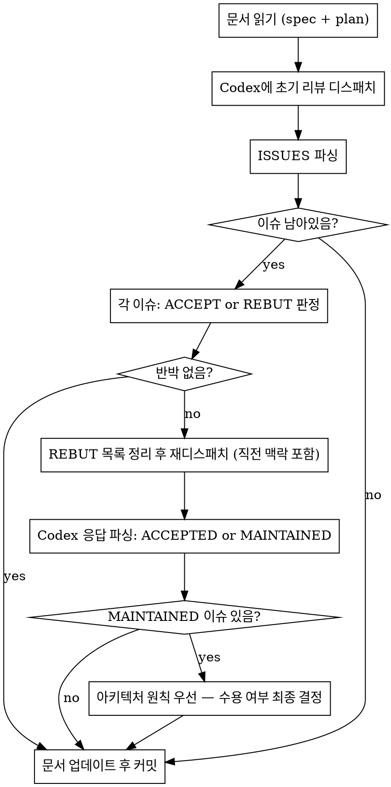

# Codex Spec/Plan Review

## Overview

Codex `adversarial-review` 서브커맨드를 활용해 스펙·계획 문서를 검토한다.
**핵심 원칙:** 구조화된 ISSUES 목록을 주고받으며 합의할 때까지 반복 후 문서를 업데이트한다.

> **Input 크기 이슈 (이전 1.0.0 Issue #1):** codex 1.0.3부터 `adversarial-review`는 diff가 기본 256KB를 초과하면 자동으로 self-collect 모드로 전환되어 shortstat + changed-files 목록만 프롬프트에 담고, Codex가 직접 `git diff`를 read-only로 읽도록 유도한다. line-ending 변경 등으로 working tree가 대량 dirty 상태여도 더 이상 `Input exceeds the maximum length of 1048576 characters` 오류가 발생하지 않는다.

---

## 플러그인 경로 해석 (버전 agnostic)

`codex-companion.mjs` 경로를 하드코딩하지 않고 설치된 최신 버전을 런타임에 resolve한다. bash command는 반드시 `node`로 시작해야 permission rule `Bash(node:*)`에 매칭된다.

```bash
node "$(ls -d /home/yeop/.claude-work/plugins/cache/openai-codex/codex/*/ | sort -V | tail -1)scripts/codex-companion.mjs" <subcommand> [args...]
```

---

## 프로세스



## Step 1 — 초기 리뷰 디스패치

스펙·플랜 문서 리뷰는 보통 작으므로 `--wait` 사용. 대규모 diff 포함 시에는 `--background`로 전환한다.

```bash
node "$(ls -d /home/yeop/.claude-work/plugins/cache/openai-codex/codex/*/ | sort -V | tail -1)scripts/codex-companion.mjs" \
  adversarial-review \
  --wait \
  "{spec_path} {plan_path} — 스펙과 구현 계획을 리뷰해줘. 리뷰 기준: API 설계 누락/모호한 엔드포인트, 아키텍처 위반(의존성 방향·레이어 책임), 누락된 예외 케이스/에러 처리, 테스트 전략 문제(단위/슬라이스/E2E), 스펙-계획 불일치. 반드시 아래 형식으로만 출력: ISSUES:\n- [ISSUE-1] <카테고리>: <설명>\n(이슈 없으면 ISSUES: 없음)"
```

**ISSUES 형식을 강제하지 않으면 파싱 불가 — focus 텍스트에 형식 지정 필수.**

> `adversarial-review`는 `review`와 달리 **focus text 지원**이 가능하다. `review`로는 focus 전달 불가.

## Step 2 — ISSUES 파싱 및 ACCEPT/REBUT 판정

Codex 출력에서 `ISSUES:` 섹션을 추출한다. 각 이슈에 대해:

| 판정 | 기준 |
|------|------|
| **ACCEPT** | 버그, 누락된 예외, 스펙-플랜 불일치, 명확한 아키텍처 위반 |
| **REBUT** | 프로젝트 규칙(CLAUDE.md)과 충돌, 이미 의도된 설계, 근거 없는 스타일 제안 |

**REBUT 기준 — 프로젝트 아키텍처 원칙이 Codex 의견보다 우선한다:**
- Entity-First (도메인 로직은 Entity에)
- Facade는 2개 이상 Service 조합 시만
- 성공 응답은 항상 HTTP 200
- `.block()` 절대 금지

## Step 3 — REBUT이 있으면 직전 맥락 포함 재디스패치

`adversarial-review`는 매번 새 thread를 시작하므로, 이전 맥락을 이어가려면 **focus text에 직전 ISSUES 섹션과 REBUTTAL을 함께 포함**해야 한다. (1.0.0의 `--resume` 직접 옵션은 slash/companion 인터페이스에 안정적으로 노출되지 않음.)

```bash
node "$(ls -d /home/yeop/.claude-work/plugins/cache/openai-codex/codex/*/ | sort -V | tail -1)scripts/codex-companion.mjs" \
  adversarial-review \
  --wait \
  "직전 리뷰에서 받은 이슈 중 일부에 반박한다. 이전 ISSUES:
<직전 ISSUES 섹션 복붙>

REBUTTAL:
- [ISSUE-N]: <반박 근거 (프로젝트 규칙 또는 설계 의도 명시)>

각 REBUTTAL에 대해 아래 형식으로 응답해줘:
REBUTTAL_RESPONSE:
- [ISSUE-N]: ACCEPTED | MAINTAINED — <이유>"
```

## Step 4 — MAINTAINED 처리

Codex가 `MAINTAINED`로 고수한 이슈는 **Claude가 최종 결정**한다:
- 프로젝트 아키텍처 원칙(CLAUDE.md)에 근거가 있으면 → **CLAUDE 결정 우선, 문서 유지**
- 근거가 불명확하면 → **ACCEPT으로 전환, 문서 수정**

반복 횟수 제한 없음. 단, MAINTAINED 이슈 수가 줄지 않으면 3라운드 후 Claude가 강제 결정.

## Step 5 — 문서 업데이트

**스펙과 계획 두 문서를 모두 검토한다.** 한쪽만 업데이트하면 불일치 발생.

- ACCEPT된 이슈 → 해당 문서(spec/plan 각각) 수정
- 수정 후 변경 내용 요약 코멘트 작성
- git commit

## Red Flags

| 상황 | 대처 |
|------|------|
| Codex가 ISSUES 형식 안 씀 | 재디스패치 시 형식을 더 엄격하게 명시 |
| Codex가 "동의" 명시 안 함 | 명시적 `ACCEPTED`/`MAINTAINED` 없으면 재요청 |
| "피드백이 좋아 보여서" 전부 ACCEPT | 프로젝트 규칙 위반 여부 반드시 확인 |
| 계획만 업데이트하고 스펙 건너뜀 | 항상 두 문서 모두 업데이트 |
| `Input exceeds the maximum length` 오류 | 1.0.3부터는 발생 안 함. 발생하면 플러그인 버전 확인 (`ls ~/.claude-work/plugins/cache/openai-codex/codex/`) |
| foreground `--wait`가 장시간 `reviewing` phase 고정 | 취소 후 `--background` 모드로 전환, status polling (Issue #2) |
| `ls -d ... codex/*/` 결과 없음 | codex 플러그인 미설치/경로 이상 — `/plugin` 으로 상태 확인 |
