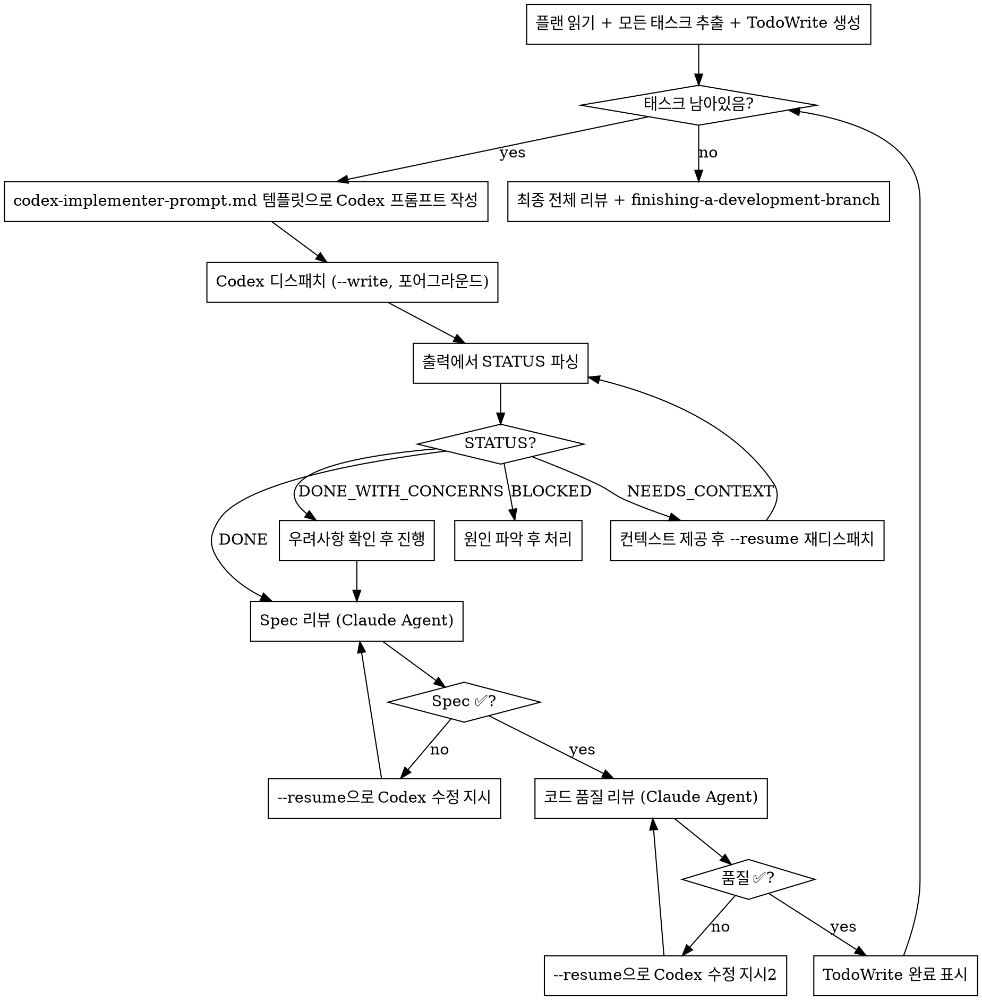

# Codex Subagent-Driven Development

## Overview

Local Codex CLI가 구현을 담당하고, Claude가 태스크 조율·리뷰를 담당하는 하이브리드 워크플로우.

**핵심 원칙:** Codex가 태스크를 구현하고 STATUS를 보고 → Claude가 spec·품질 리뷰 → 반복

## 역할 분담

| 역할 | 담당 |
|------|------|
| 태스크 추출 · 조율 · 진행 추적 | Claude (나) |
| 구현 · TDD · 커밋 | **Codex CLI** (`codex-companion.mjs task --write`) |
| Spec 준수 리뷰 | Claude (Agent 도구) |
| 코드 품질 리뷰 | Claude (Agent 도구) |

## Codex 디스패치 방법

> **플러그인 경로 버전 agnostic:** `codex-companion.mjs` 경로는 하드코딩하지 않고 설치된 최신 버전을 런타임에 resolve한다. bash command가 반드시 `node`로 시작해야 permission rule `Bash(node:*)`에 매칭된다.

```bash
# 프롬프트를 파일로 작성 후 stdin redirection으로 전달 (명령이 node로 시작해야 permission rule 매칭)
# 1. 프롬프트를 파일에 먼저 저장
cat > /tmp/task-prompt.txt << 'EOF'
[프롬프트 내용]
EOF

# 2. stdin redirection으로 실행 (명령이 node로 시작 → permission rule 매칭)
node "$(ls -d /home/yeop/.claude-work/plugins/cache/openai-codex/codex/*/ | sort -V | tail -1)scripts/codex-companion.mjs" task --write < /tmp/task-prompt.txt

# 이전 스레드 이어가기 (fix 루프)
node "$(ls -d /home/yeop/.claude-work/plugins/cache/openai-codex/codex/*/ | sort -V | tail -1)scripts/codex-companion.mjs" task --write --resume < /tmp/task-prompt.txt
```

**`--write` 필수** — 파일 변경 권한이 없으면 구현 불가.
**`--background` 사용 금지** — 포어그라운드로 실행해야 출력을 즉시 파싱 가능.
**`echo | node` 금지** — permission rule이 `node`로 시작하는 명령만 매칭한다. 반드시 파일에 저장 후 `< /tmp/task-prompt.txt` 로 전달.

## 전체 프로세스



## Codex 프롬프트 작성

**REQUIRED:** `./codex-implementer-prompt.md` 템플릿을 사용한다.

템플릿에 반드시 채워야 할 항목:
1. 프로젝트 컨텍스트 1-2줄
2. 태스크 번호와 플랜 위치
3. 플랜 해당 태스크 전체 텍스트 (요약 금지)
4. 이전 태스크에서 생성된 파일 중 이 태스크가 의존하는 것 목록

## STATUS 파싱

Codex 출력 마지막에서 STATUS 줄 추출:
```bash
# 출력을 변수에 저장하거나 파일로 읽어서
grep "^STATUS:" <output>
```

STATUS 키워드가 없으면 → Codex가 템플릿을 따르지 않은 것. `--resume`으로 재요청:
```
이전 작업이 완료되었으면, 지정된 형식으로 보고해주세요:
STATUS: [DONE|DONE_WITH_CONCERNS|NEEDS_CONTEXT|BLOCKED]
...
```

## fix 루프 (리뷰 이슈 수정)

Spec 또는 품질 리뷰에서 이슈가 발견되면:

```bash
cat > /tmp/task-prompt.txt << 'EOF'
리뷰에서 다음 이슈가 발견되었습니다:
- [이슈 1]: [파일:줄]
- [이슈 2]: [파일:줄]

수정 후 동일한 보고 형식으로 완료를 알려주세요.
EOF
node "$(ls -d /home/yeop/.claude-work/plugins/cache/openai-codex/codex/*/ | sort -V | tail -1)scripts/codex-companion.mjs" task --write --resume < /tmp/task-prompt.txt
```

**같은 스레드를 이어가므로** Codex가 이전 컨텍스트를 유지한다.

## BLOCKED 처리

| 원인 | 처리 |
|------|------|
| 필요한 파일/클래스가 아직 없음 | 선행 태스크 먼저 완료 후 재시도 |
| 아키텍처 판단이 필요 | Claude가 직접 판단 후 지시 내용 포함해 `--resume` |
| 예상 외 코드 상태 | Claude가 코드 확인 후 `--fresh`로 재디스패치 |
| 태스크가 너무 큼 | 태스크를 더 작게 분할 후 재시도 |

## 리뷰 디스패치

**Spec 리뷰:** `superpowers:requesting-code-review` 스킬의 spec-reviewer-prompt.md 템플릿 사용.  
**품질 리뷰:** 동일 스킬의 code-quality-reviewer-prompt.md 템플릿 사용.  
**순서 필수:** 반드시 Spec 리뷰 ✅ 후에만 품질 리뷰 시작.

## Red Flags

- `--background` 사용 → 출력 파싱 불가, 포어그라운드 사용
- STATUS 없이 진행 → 반드시 파싱 후 다음 단계 결정
- Spec 리뷰 전 품질 리뷰 → 금지
- 미해결 이슈로 다음 태스크 진행 → 금지
- Codex에게 플랜 파일 직접 읽으라고 함 → 태스크 텍스트를 프롬프트에 직접 포함
