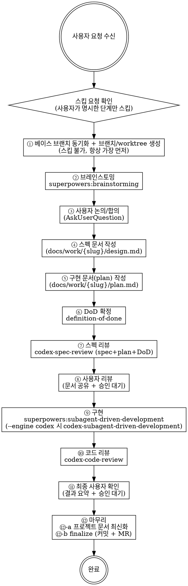

# Feature Workflow

## Overview

기능 개발의 전체 라이프사이클을 단계별로 오케스트레이션한다.
**핵심 원칙:** 사용자가 명시적으로 스킵을 요청하지 않는 한, 모든 단계를 반드시 수행한다.

**기본 격리 원칙:** 베이스 브랜치 동기화와 worktree+브랜치 생성을 **가장 먼저** 수행하고, 이후의 모든 작업(브레인스토밍 메모, spec/plan 문서, codex 리뷰 산출물, 구현 코드, finalize)은 worktree 디렉터리 안에서만 진행한다. 베이스 브랜치 작업 트리는 처음부터 끝까지 untouched 상태를 유지한다.

**문서 배치 규약:** 이 워크플로가 만드는 산출 문서(스펙·플랜·DoD)는 모두 **`docs/work/{slug}/` 한 디렉터리에 모은다.**

| 문서 | 경로 |
|------|------|
| ④ 스펙 | `docs/work/{slug}/design.md` |
| ⑤ 플랜 | `docs/work/{slug}/plan.md` |
| ⑥ DoD | `docs/work/{slug}/dod.md` (definition-of-done 스킬 기본 경로 `docs/dod/` 대신 이 경로 사용) |

`{slug}`는 ① 단계의 브랜치 슬러그와 동일하게 맞춘다 (예: `feat/issue-40-foo` → `docs/work/issue-40-foo/`).

## 전체 프로세스



## 스킵 규칙

- **기본값:** 모든 단계 수행 (스킵 없음)
- **스킵 허용 조건:** 사용자가 `/feature-workflow --skip 2,7` 또는 대화 중 "브레인스토밍은 건너뛰자" 등 명시적으로 요청한 경우만
- **스킵 불가 단계:** ① 브랜치+worktree 생성, ⑫ finalize (이 두 단계는 항상 수행)

| 스킵 시나리오 | 권장 스킵 |
|-------------|----------|
| 간단한 버그픽스 (원인 명확) | ②③④⑤⑥⑦⑧ 스킵 가능 |
| 이미 스펙이 존재 | ②③④ 스킵 가능 (단, 기존 spec/plan을 worktree로 옮겨 진행) |
| Codex 없이 직접 구현 | ⑦⑩ 스킵 (대신 superpowers 리뷰 사용) |

## 옵션

`/feature-workflow` 호출 시 또는 대화 중 자연어로 동일 효과를 낼 수 있다.

| 옵션 | 의미 | 기본값 |
|------|------|--------|
| `--base <branch>` | 베이스 브랜치 (피처 브랜치를 따낼 기준) | `dev` |
| `--engine <codex|>` | 구현 엔진 — `codex` 지정 시 `codex-subagent-driven-development`, 미지정 시 `superpowers:subagent-driven-development` | (미지정) |
| `--skip <단계번호,...>` | 스킵할 단계 번호 (① 과 ⑫ 은 스킵 불가) | (없음) |

자연어 예시: "이번엔 main에서 분기해줘" → `--base main`. "구현은 codex로" → `--engine codex`. "브레인스토밍은 건너뛰자" → `--skip 2`.

## 단계별 위임 모델 (model routing)

**원칙:** 비싼 지능(Opus)은 *판단이 일어나는 곳*(계획·리뷰)에 쓰고, 명세 실행·기계적 작업·탐색은 저렴한 모델에 위임한다. 메인 오케스트레이터 세션은 길고 깨끗하게 유지하고, 시끄러운 작업(코드베이스 탐색, 반복 빌드/수정)은 fresh-context 서브에이전트로 떼어내 context rot를 막는다.

| 단계 | 실행 위치 | 권장 모델 | 근거 |
|------|----------|----------|------|
| 사전 탐색 (broad 검색) | `Explore` 서브에이전트 | Haiku | fan-out 검색, 결과만 회수 |
| 사전 탐색 (영향범위·의존성) | `analyzer` 서브에이전트 | Sonnet | 패턴·의존성 추적 분석 |
| ④ 스펙 / ⑤ plan 작성 | 메인 세션 | Opus 권장 | 지능 front-load → 구현 단순화 |
| ⑥ DoD 확정 | `definition-of-done` | Opus 권장 | 완료 계약은 판단 — spec·plan 근거로 검증 가능 조건 확정 |
| ⑦ 스펙·플랜·DoD 리뷰 | `codex-spec-review` | codex(GPT) | 외부 관점 |
| ⑨ 구현 (task별) | `subagent-driven-development` | **Sonnet 기본** | 정밀 plan = 명세 실행 |
| ⑨ escalate → Opus | 동시성/레이스 · 보안·금전 정확성 · 숨은결합 리팩토링 · plan 모호 | **Opus** | silent bug 비용 > 모델 가격차(1.67x) |
| ⑩ 코드 리뷰 | `codex-code-review` (+ Opus 교차) | codex + Opus | 강한 리뷰로 Sonnet 미스 보강 |
| ⑫-a 설계 문서 | `general-purpose` | Sonnet | 설계 판단 |
| ⑫-a 기계 문서 | `general-purpose` | Haiku | 기계적 갱신 |

- 위 모델은 **권장 기본값**이다. 비용·가용성·태스크 난이도에 따라 override 가능 (`--engine`, 자연어 지정).
- **사전 탐색 위임 원칙:** 코드베이스를 메인 세션에서 직접 광범위하게 읽지 말고 `Explore`/`analyzer` 서브에이전트에 위임해 distilled 결과만 받는다 (메인 세션 오염 방지 → context rot 회피). 단, 원인이 명확한 소규모 버그픽스는 오버헤드가 더 크므로 메인 세션에서 직접 탐색해도 된다.

## 단계별 상세

### ① 베이스 브랜치 동기화 + 브랜치/worktree 생성 (스킵 불가, 항상 가장 먼저)

**이 단계는 모든 작업의 출발점이다.** 브레인스토밍·spec/plan 작성·codex 리뷰·구현·finalize 모두 worktree 안에서 수행되어야 베이스 브랜치(dev) 작업 트리를 더럽히지 않고 작업이 격리된다.

**ⓘ 스킬(권장):** `superpowers:using-git-worktrees` 호출로 안전 점검과 디렉터리 결정을 위임한다. 스킬을 사용하지 않을 때는 아래 절차를 직접 수행한다.

#### ①-1. 작업 정보 결정

다음 정보를 결정한다:

| 항목 | 결정 방식 |
|------|----------|
| 베이스 브랜치 | `--base` 옵션 또는 자연어. 미지정 시 `dev`. |
| 브랜치 prefix | feature는 `feat/`, bugfix는 `fix/`, refactor는 `refactor/`, chore는 `chore/` 등. 사용자 요청 유형으로 추론. |
| 브랜치 슬러그 | 이슈 번호가 있으면 `issue-N-{짧은-주제}` (예: `issue-40-path-fine-tuning-path-exists`). 없으면 작업 주제에서 kebab-case 슬러그. 추론이 모호하면 `AskUserQuestion`으로 한 번 확인 후 진행. |
| 브랜치 풀네임 | `{prefix}{슬러그}` (예: `feat/issue-40-path-fine-tuning-path-exists`) |
| worktree 디렉터리 | 프로젝트 루트의 `.worktrees/{branch-name slash → dash}` (예: `.worktrees/feat-issue-40-path-fine-tuning-path-exists`) |

#### ①-2. 베이스 브랜치 동기화

```bash
# 베이스 브랜치를 최신 origin으로 fast-forward
git fetch origin
git checkout {base-branch}      # 예: dev
git pull --ff-only origin {base-branch}
```

- 베이스 브랜치에 staged/unstaged 변경이 있으면 진행 전에 사용자와 처리 방향 합의 (stash, 다른 브랜치로 분리, 무관한 변경이면 일단 stash 후 worktree 생성).
- 베이스 브랜치가 `pull --ff-only`로 fast-forward 불가면 (로컬 분기 또는 충돌) 즉시 멈추고 사용자에게 보고.
- 베이스 브랜치 작업 트리에 untracked 파일이 있어도 OK — `git worktree add`는 untracked 파일을 옮기지 않으므로 베이스 작업 트리에 그대로 남는다. 본 워크플로우는 시작부터 worktree 안에서만 작업하므로 untracked 파일을 옮길 필요가 없다.

#### ①-3. 브랜치 + worktree 동시 생성

```bash
WORKTREE_DIR=".worktrees/{branch-name-dashed}"
git worktree add -b {branch-name} "$WORKTREE_DIR" {base-branch}
cd "$WORKTREE_DIR"
```

- 이후 모든 명령은 `$WORKTREE_DIR` 안에서 실행한다.
- worktree 위치를 `.worktrees/` 외 다른 경로로 두고 싶으면 사용자가 명시한 경로를 사용한다.
- worktree 정리는 ⑫ MR 머지 이후에만 수행한다 (`git worktree remove .worktrees/{branch-name-dashed}`).

#### ①-4. 첫 커밋(빈 커밋) — 선택

이후 ④ spec, ⑤ plan 작성 후 자연스럽게 첫 커밋이 발생하므로 별도 빈 커밋은 만들지 않는다.

### ② 브레인스토밍

**스킬:** `superpowers:brainstorming` 호출 (worktree 안에서)

- CLAUDE.md의 브레인스토밍 체크리스트 항목을 반드시 다룬다
- 결과물: 요구사항 정리, API 설계 초안, 예외 케이스 목록
- 브랜치명/베이스가 ① 단계에서 이미 결정됐으므로 브레인스토밍에서는 다시 묻지 않는다 — 이미 결정된 정보를 컨텍스트로 사용한다
- **사전 탐색은 위임:** 기존 코드 패턴·영향 범위 파악이 필요하면 메인 세션에서 직접 광범위하게 읽지 말고 `Explore`/`analyzer` 서브에이전트에 위임하고 요약 결과만 컨텍스트로 사용한다 (메인 세션 오염 방지 → context rot 회피). 합의·판단(③)은 메인 세션이 유지한다. 소규모 버그픽스는 예외.

### ③ 사용자 논의/합의

- 브레인스토밍 결과를 사용자에게 제시
- AskUserQuestion으로 합의 확인
- 합의 전까지 다음 단계 진행 금지

### ④ 스펙 문서 작성

- `docs/work/{slug}/design.md` 경로에 스펙 문서 생성 (worktree 안)
- 브레인스토밍 합의 사항 반영
- 작성 후 self-review (placeholder/contradictions/scope/ambiguity 점검) — 필요한 경우 `superpowers:writing-plans` 스킬을 호출하면 spec → plan 일관 검토 가이드를 활용할 수 있음
- **격리 원칙:** 이 문서는 처음부터 worktree 안의 경로에 만들어진다. 베이스 브랜치 작업 트리에는 절대 만들지 않는다.

### ⑤ 구현 문서(plan) 작성

**스킬:** `superpowers:writing-plans` 호출 (worktree 안에서)

- `docs/work/{slug}/plan.md` 경로에 plan 문서 생성 (worktree 안)
- 태스크 단위로 분해 (subagent-driven-development가 소비할 형태)
- 각 태스크는 파일 경로 / 정확한 코드 / 명령 / 예상 결과를 포함한다 (placeholder 금지)
- **격리 원칙:** 이 문서도 처음부터 worktree 안에 만든다.

### ⑥ DoD 확정

**스킬:** `definition-of-done` 호출 (worktree 안에서)

- 합의된 스펙(④)·플랜(⑤)을 입력으로 "무엇을 충족하면 완료인가"를 **검증 가능한 계약**으로 확정한다 — 인상이 아니라 **명령 exit code**로 판정 가능한 조건.
- 각 완료 조건은 실행 가능한 검증 명령(테스트/빌드/lint 등)과 기대 결과를 명시한다.
- 산출물은 `docs/work/{slug}/dod.md`에 남긴다 (definition-of-done 스킬 기본 경로 `docs/dod/` 대신). 이 DoD가 **⑨ 구현 완료 판정**과 **⑪ 최종 확인**의 근거가 된다.

### ⑦ 스펙 리뷰

**스킬:** `codex-spec-review` 호출

- 스펙 + 플랜 + **DoD** 세 문서를 함께 리뷰한다 (DoD가 스펙·플랜과 정합하고, 완료 조건이 검증 가능·충분한지 포함).
- ACCEPT/REBUT 루프 완료 후 문서 업데이트
- MAINTAINED 이슈는 Claude가 최종 결정하며, 사용자 합의 스코프를 변경하는 결정이라면 사용자 review에 명시 보고

### ⑧ 사용자 리뷰

- 최종 스펙·플랜 문서를 사용자에게 공유
- AskUserQuestion으로 승인 대기
- 수정 요청 시 문서 수정 후 재확인

### ⑨ 구현

**기본 스킬:** `superpowers:subagent-driven-development`
**`--engine codex` 또는 "구현은 codex로" 명시 시:** `codex-subagent-driven-development`

- 플랜 문서의 태스크를 순서대로 실행
- 태스크별 리뷰 포함 (스킬 내부 프로세스)
- 엔진 미지정 시 반드시 `superpowers:subagent-driven-development` 사용
- **모델:** `단계별 위임 모델` 표 참조 — **Sonnet 기본**, escalate 조건(동시성/레이스·보안·금전 정확성·숨은결합 리팩토링·plan 모호) 해당 시 **Opus**
- 모든 작업은 worktree 디렉터리 안에서 수행

### ⑩ 코드 리뷰

**스킬:** `codex-code-review` 호출

- 브랜치 전체 diff 대상 (`--scope branch --base {base-branch}`)
- 지적 사항 반영 후 빌드·테스트 확인

### ⑪ 최종 사용자 확인

- 구현 결과 요약 제시 (변경 파일, 테스트 결과, 주요 결정 사항)
- AskUserQuestion으로 최종 승인
- 추가 수정 요청 시 반영 후 재확인

### ⑫ 마무리 (스킵 불가)

#### ⑫-a. 프로젝트 문서 최신화

`finalize` 호출 **전에** tech-docs 에이전트 두 개를 **순차 실행**한다. 설계 판단이 필요한 갱신은 Sonnet, 기계적 갱신은 Haiku에 위임한다.

**1) 설계성 문서 갱신 (Sonnet)**

```
Agent(
  prompt: ".claude/agents/tech-docs-design.md를 역할 정의로 사용한다.
  - 브랜치: [현재 브랜치명]
  - Plan: [플랜 경로]
  - Spec: [스펙 경로]",
  subagent_type: "general-purpose",
  model: "sonnet"
)
```

담당 범위:

| 변경 감지 | 업데이트 대상 |
|----------|------------|
| Flyway migration 추가 | `.ai/diagrams/erd.md` ERD |
| Entity 상태 enum 변경 | `.ai/diagrams/{domain}.md` 상태 다이어그램 |
| 아키텍처 규칙 변경 | `.ai/architecture/*`, CLAUDE.md |
| 신규 tech-debt 항목 발생 | `docs/tech-debt.md` 신규 추가 |
| SecurityConfig 영향 | 경고 출력 (테스트 영향 확인) |

**2) 기계적 문서 갱신 (Haiku)**

설계성 단계가 완료된 뒤 실행한다.

```
Agent(
  prompt: ".claude/agents/tech-docs-mechanical.md를 역할 정의로 사용한다.
  - 브랜치: [현재 브랜치명]
  - Plan: [플랜 경로]
  - Spec: [스펙 경로]",
  subagent_type: "general-purpose",
  model: "haiku"
)
```

담당 범위:

| 변경 감지 | 업데이트 대상 |
|----------|------------|
| Controller 추가/수정 | `docs/progress/{app}.md` 엔드포인트 상태·카운트 |
| progress 카운트 변동 | `docs/progress/README.md` 진행률 |
| tech-debt 해소 | `docs/tech-debt.md` 취소선 + ✅ 프리픽스 |

에이전트 실행 후 추가로 수동 점검:
1. 플랜 문서의 태스크 체크박스를 모두 완료(`[x]`) 처리한다
2. 스펙 문서에 구현 중 변경된 사항(API 시그니처, 예외 케이스 등)을 반영한다

#### ⑫-b. finalize

**스킬:** `finalize` 호출

- ⑫-a에서 최신화한 문서를 포함하여 커밋
- MR 생성 (target: `{base-branch}`, 기본값 `dev`)

##### 이슈 자동 close 규칙 (필수)

본 워크플로가 **이슈 번호를 컨텍스트로 시작했다면** (① 단계에서 `issue-N-...` 브랜치 슬러그로 결정), MR/PR 본문에 해당 이슈를 close하는 키워드를 **반드시** 포함시킨다.

| Host | close 키워드 |
|------|-------------|
| GitLab | `Closes #N` (description 최상단 또는 별도 섹션) |
| GitHub | `Closes #N` / `Fixes #N` / `Resolves #N` (PR body) |

복수 이슈인 경우 `Closes #N, #M` 또는 줄바꿈으로 나열. 부모/자식 구조라면 자식 이슈만 close하고 부모는 별도 트리거(또는 모든 자식 close 시 수동 close)로 처리한다.

**금지:**
- "Refs #N" / "Related #N" 같은 약한 표현으로 대체하지 않는다 — close 키워드를 명시.
- ⑫-a 문서 갱신 + 검증 검토 모두 통과한 상태에서만 MR을 만든다. 미완 작업이 남아있다면 close 키워드 보류하고 Draft MR.

**적용 위치:** MR description의 `## Summary` 위 또는 첫 줄. finalize 스킬 호출 시 `glab mr create --description` / `gh pr create --body` 본문 최상단에 삽입.

예시:
```markdown
Closes #81

## Summary
- ...
```

## 단계 전환 시 체크

각 단계가 끝날 때 다음을 확인한다:

1. **현재 단계 산출물이 존재하는가?** (worktree, 문서, 코드, 커밋 등)
2. **다음 단계가 스킵 대상인가?** → 스킵이면 그 다음 단계로 이동
3. **사용자 확인이 필요한 단계인가?** (③⑧⑪) → 승인 없이 진행 금지
4. **현재 작업 디렉터리가 worktree인가?** → ① 이후 모든 단계는 worktree 안에서 수행. 베이스 브랜치 작업 트리에서 진행 중이라면 즉시 `cd $WORKTREE_DIR`.

## Red Flags

| 상황 | 대처 |
|------|------|
| ① 단계 없이 ② 브레인스토밍부터 진행 | ① 베이스 브랜치 동기화 + worktree 생성을 먼저 수행. spec/plan 작성 시점에 베이스 트리가 더럽혀지는 것을 막기 위해 ①은 항상 가장 먼저. |
| 베이스 브랜치 작업 트리에 spec/plan 문서가 만들어짐 | 잘못된 작업 디렉터리. 즉시 worktree로 이동하고, untracked 문서는 worktree로 `mv` 후 첫 커밋에 포함. |
| `git pull --ff-only` 실패 | 베이스 브랜치가 로컬에서 분기. 사용자에게 보고하고 합의 후 처리 (rebase 또는 reset). 임의로 `--force` 또는 reset 금지. |
| 사용자 승인 없이 다음 단계 진행 | ③⑧⑪은 반드시 승인 후 진행 |
| 스킵 요청 없이 단계 건너뜀 | 모든 단계 수행이 기본값 |
| 베이스 브랜치(`dev`)에서 직접 커밋 | 절대 금지. 항상 ① 단계로 worktree+피처 브랜치 만들고 그 안에서 커밋. |
| MR 머지 전 worktree 삭제 | 머지 + 원격 브랜치 정리 후에만 `git worktree remove` 실행 |
| 스펙 없이 구현 시작 | ④⑤ 완료 후 구현 |
| finalize 없이 작업 종료 | ⑫은 항상 수행 |
| 문서 최신화 없이 finalize 실행 | ⑫-a 점검 후 ⑫-b finalize 진행 |
| 다이어그램/스펙이 구현과 불일치 | 구현 기준으로 문서를 먼저 업데이트 |
| 이슈 컨텍스트로 시작했는데 MR/PR에 `Closes #N` 누락 | 즉시 description 수정. 약한 표현(`Refs`, `Related`)으로 대체 금지. ⑫-b 항상 close 키워드 포함. |
